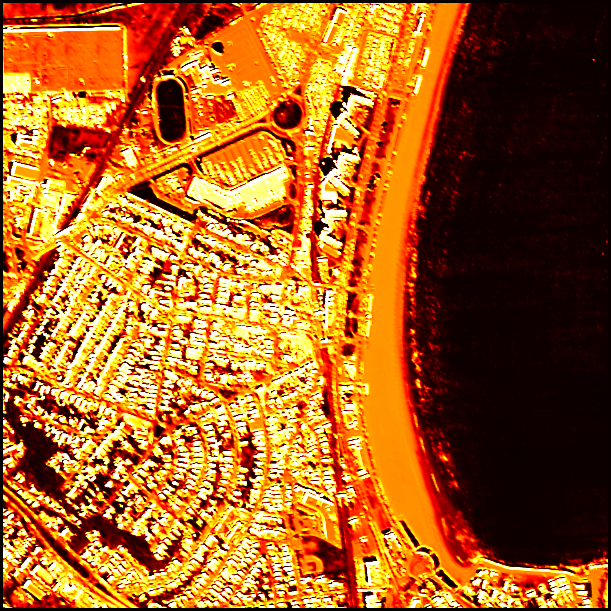
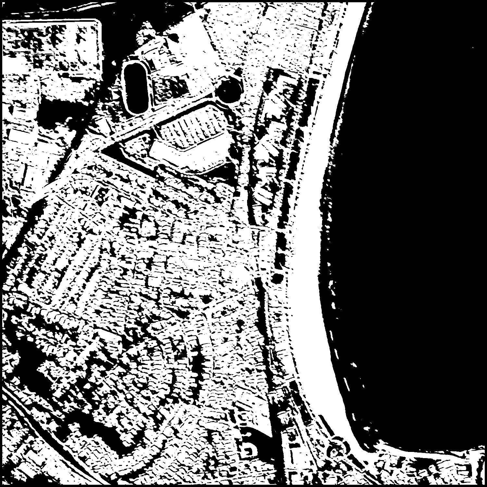

# 🏗️ Building Segmentation — Patch-Based CNN Classification

A **semantic segmentation** pipeline that classifies every pixel in satellite imagery as `building` or `background`, using a patch-based CNN approach on the Massachusetts Buildings Dataset.

> 📚 Deep Learning & Computer Vision — University Project (2024/2025)  
> Author: **Davide Corso**

---

## Results

| Confidence Map | Predicted Mask |
|:-:|:-:|
|  |  |

## The Problem

Given high-resolution satellite images, the goal is to automatically identify and segment buildings at pixel level — a core task in remote sensing and urban planning.

## Approach

Instead of full-image segmentation (like U-Net), this project uses a **segmentation-by-classification** strategy:

1. **Extract patches** (15×15 px) centered on labeled pixels from training images
2. **Train a CNN** to classify each patch as building or background
3. **Apply densely** across entire test images to produce pixel-wise predictions
4. **Generate** confidence maps and binary segmentation masks

## Pipeline

```
Satellite Image → Extract Patches → Train CNN → Dense Prediction → Segmentation Mask
```

1. **Dataset loading** — satellite images + ground truth masks
2. **Balanced patch extraction** — equal building/background samples per image
3. **CNN training** — convolutional classifier on image patches
4. **Dense inference** — sliding window prediction across full images
5. **Evaluation** — accuracy, AUC-ROC, confusion matrix

## Dataset

**Massachusetts Buildings Dataset** — aerial imagery with pixel-level building annotations.

The dataset is not included due to size. It can be found on [Kaggle](https://www.kaggle.com/datasets/balraj98/massachusetts-buildings-dataset).

## Tech Stack

- **Python 3** — data processing
- **Keras / TensorFlow** — CNN model
- **NumPy** — array manipulation
- **scikit-image** — image loading
- **scikit-learn** — evaluation metrics
- **Matplotlib** — visualizations

## Getting Started

```bash
pip install keras tensorflow numpy scikit-image scikit-learn matplotlib tqdm
```

1. Download the [Massachusetts Buildings Dataset](https://www.kaggle.com/datasets/balraj98/massachusetts-buildings-dataset) and place it in an `archive/` folder
2. Run the notebook: `jupyter notebook building_segmentation.ipynb`

## Project Structure

```
├── building_segmentation.ipynb      # Full pipeline notebook
├── building_segmentation_model.h5   # Trained model weights (1.2MB)
├── outputs/
│   ├── confidence_map.png           # Prediction confidence heatmap
│   └── predicted_mask.png           # Binary segmentation output
└── docs/
    └── presentation.pdf             # Project presentation slides
```

## License

All rights reserved. This project is shared for portfolio and educational purposes only.
